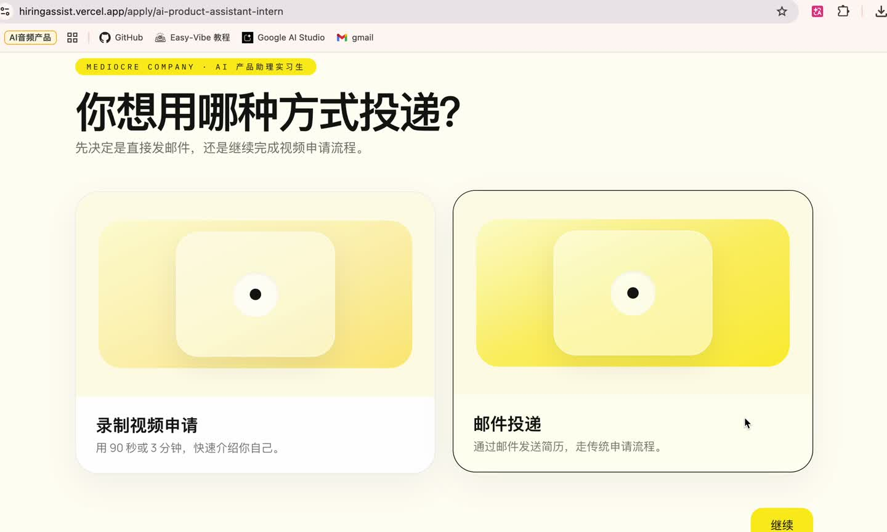

# HireFlow

> 视频优先的招聘投递体验。候选人可以先看清岗位，再用一段简短自我介绍视频和一份 PDF 简历完成申请；HR 则直接收到结构化通知和可下载素材。

<p align="center">
  <a href="https://hiringassist.vercel.app"><strong>Live Demo</strong></a>
  ·
  <a href="./docs/assets/hireflow-demo.mp4"><strong>Watch Product Demo</strong></a>
</p>

<p align="center">
  

https://github.com/user-attachments/assets/7d0e4699-0ee4-4a66-948e-212c3d9952b5


  <a href="./docs/assets/hireflow-demo.mp4">
    
  </a>
</p>

## What Is HireFlow

传统招聘投递通常分散在职位页、邮件、网盘和表单之间，候选人需要反复切换流程，HR 也很难快速获得一份带上下文的申请。

HireFlow 把这条链路压缩成一个更直接的产品体验：

- 在同一个页面浏览职位列表和 JD
- 进入申请向导后，选择视频申请或传统邮件投递
- 在浏览器内完成自我介绍录制、简历上传和提交
- 由系统把申请素材整理成 HR 可直接处理的通知邮件

这让它更像一个完整的招聘投递产品，而不是一个单独的上传表单。

## Why It Feels Like A Product

- `Video-first application`: 候选人可以用 90 秒到 3 分钟的视频快速说明经历、动机和岗位匹配度。
- `JD and application in one flow`: 浏览职位、阅读 JD、开始申请在同一体验里完成，不需要跳出页面。
- `Fallback path included`: 不适合站内录制时，仍然可以切回邮件投递，降低流失。
- `HR-ready delivery`: 申请提交后，HR 会收到包含视频和简历下载链接的通知邮件。
- `Trust and integrity`: 提交流程接入 Turnstile、人机校验和已上传资产校验，避免无效提交。

## Candidate Journey

1. 候选人在 `/` 浏览职位列表，并查看右侧 JD 详情。
2. 进入 `/apply/[jobId]` 后，选择视频申请或邮件投递。
3. 候选人在浏览器内录制自我介绍，并上传 PDF 简历。
4. 前端向 `/api/uploads/sign` 请求上传签名，然后把文件直传到 COS。
5. 上传完成后，前端调用 `/api/uploads/ingest` 确认素材已就绪。
6. 候选人完成一次 Turnstile 校验，并调用 `/api/submit` 提交申请。
7. 服务端校验职位、验证码与素材状态，再通过邮件把申请发送给 HR。

当前版本已移除 OTP 验证，候选人邮箱仅作为联系信息随申请一并发送。

## Product Highlights

### In-browser recording

- 浏览器内直接调用摄像头录制
- 支持录制完成后的回看与重录
- 不需要额外下载桌面端工具

### Direct-to-storage upload

- 服务端只负责签发 presigned URL
- 视频和简历由浏览器直接上传到腾讯云 COS
- 减少应用服务器带宽和存储压力

### Submission safety

- Cloudflare Turnstile 负责基础人机验证
- 服务端二次确认素材是否已经完成上传
- 提交链路对职位、文件和校验状态都有显式校验

### HR notification workflow

- 使用 Resend 发送最终申请通知
- 邮件中包含视频与简历下载链接
- 可通过环境变量统一切换测试收件箱或正式收件箱

## Tech Stack

- `Next.js 16`
- `React 19`
- `Tailwind CSS 4`
- `Tencent Cloud COS` for direct uploads
- `Upstash Redis`
- `Cloudflare Turnstile`
- `Resend`
- `Vercel`

## Local Development

安装依赖：

```bash
npm install
```

启动开发服务器：

```bash
npm run dev
```

默认访问 `http://localhost:3000`。

## Environment Variables

复制 `.env.example` 为 `.env.local`，并补齐以下配置：

```env
RESEND_API_KEY=
RESEND_FROM_EMAIL=
NOTIFY_EMAIL=

NEXT_PUBLIC_OPEN_ROLES_EMAIL=
NEXT_PUBLIC_APPLY_EMAIL_OVERRIDE=

UPSTASH_REDIS_REST_URL=
UPSTASH_REDIS_REST_TOKEN=

NEXT_PUBLIC_TURNSTILE_SITE_KEY=
TURNSTILE_SECRET_KEY=

COS_SECRET_ID=
COS_SECRET_KEY=
COS_BUCKET_NAME=
COS_REGION=
```

关键项说明：

| Variable | Purpose |
| --- | --- |
| `NOTIFY_EMAIL` | 最终接收申请通知的 HR 邮箱 |
| `NEXT_PUBLIC_OPEN_ROLES_EMAIL` | 首页展示的公开联系邮箱 |
| `NEXT_PUBLIC_APPLY_EMAIL_OVERRIDE` | 覆盖职位默认投递邮箱，适合统一切到测试收件箱 |
| `RESEND_FROM_EMAIL` | 发送通知邮件的发件地址 |
| `NEXT_PUBLIC_TURNSTILE_SITE_KEY` / `TURNSTILE_SECRET_KEY` | Turnstile 前后端校验配置 |
| `COS_*` | 腾讯云 COS 的 S3 兼容上传配置 |

## Third-party Setup

### Cloudflare Turnstile

允许的 Hostname 至少包含：

- `localhost`
- `hiringassist.vercel.app`

### Tencent Cloud COS CORS

至少允许以下 Origin：

```json
[
  {
    "AllowedOrigins": [
      "http://localhost:3000",
      "https://hiringassist.vercel.app"
    ],
    "AllowedMethods": ["GET", "PUT", "HEAD"],
    "AllowedHeaders": ["*"],
    "ExposeHeaders": ["ETag", "Content-Length"],
    "MaxAgeSeconds": 3600
  }
]
```

### Resend

如果还在测试阶段，建议先把 HR 通知邮箱保持为 Resend 账号自身邮箱。切换到正式邮箱时，建议按下面顺序处理：

1. 在 Resend 中验证自有域名。
2. 把 `RESEND_FROM_EMAIL` 改成该域名下的地址。
3. 再把 `NOTIFY_EMAIL` 和 `NEXT_PUBLIC_APPLY_EMAIL_OVERRIDE` 切到目标收件箱。

## Verification

```bash
npm run lint -- --max-warnings=0
npm run build
```

## Deployment

项目当前部署在 Vercel：

- 线上地址：`https://hiringassist.vercel.app`
- redeploy 前确认 Vercel 环境变量已经同步
- 确认 Turnstile 已加入线上域名
- 确认 COS CORS 已加入线上域名

满足以上条件后，直接重新部署即可。
